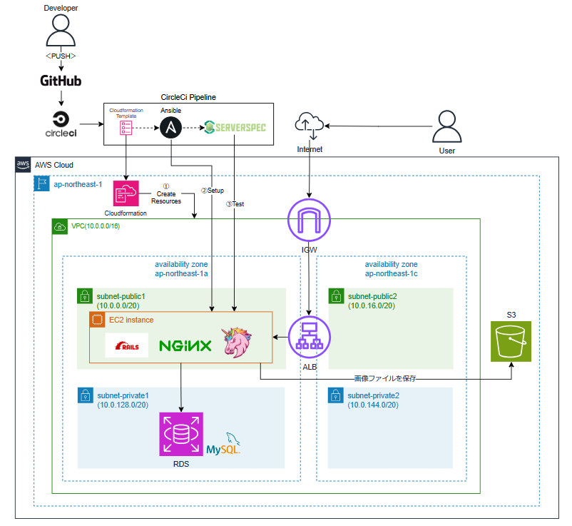

# RaiseTech ASWコース

## 概要
RaiseTech ASWコースの課題提出用のリポジトリです。

## 最終的に実現したこと 
AnsibleやCircleCIを用いて、AWS上でインフラ環境構築から
Webアプリケーションのデプロイまでを自動化処理で行いました。  

__<最終的な構成図と自動化処理フロー>__  
 

__<自動化処理で使用したツールの設定>__
- [CircleCI](./circleci/config.yml) 

- [Cloudformation ](./cloudformation) 

- [Ansible ](./ansible) 

- [Serverspec ](./serverspec) 

## 講義概要・課題・提出物
| No | 講義概要 | 課題 | 提出物 |
| :----: | :---- | :---- | :----: |
| 1 | AWSの概要 | ・AWSアカウント作成  ・Cloud9作成 | - |
| 2 | バージョン管理 | ・GitHub初期設定  ・リポジトリ作成からプルリクエスト実施 | [lecture02](lecture02.md) |
| 3 | Webアプリケーションと構成管理 | Cloud9にRailsアプリケーションをデプロイ|  [lecture03](lecture03.md) |
| 4 | AWSのリソースと権限管理 | VPC、EC2、RDS作成 | [lecture04](lecture04.md) |
| 5 | ELB、S3について | ・EC2にRailsアプリケーションをデプロイ  ・構築した環境にELB、S3を追加  ・構築した環境の構成図の作成 | [lecture05](lecture05.md) |
| 6 | AWSでの監視、通知、コスト管理 | ・CloudTrailのイベント抽出  ・CloudWatchAlarmとSNSでALBのアラーム設定  ・AWS利用料の見積作成 | [lecture06](lecture06.md) |
| 7 | AWSでのセキュリティ対策 | 第5回までに構築した環境の脆弱性と対策の考察 | [lecture07](lecture07.md) |
| 8 | 構築の実演（第4,5回の課題） | - | - |
| 9 | 構築の実演（第4,5回の課題）| - | - |
| 10 | インフラの自動化とCloudFormation | 第5回までに構築した環境をCloudFormationでコード化 | [lecture10](lecture10.md) |
| 11 | インフラのコード化とテスト駆動開発 | ServerSpecでテストを実施 | [lecture11](lecture11.md) |
| 12 | Terraform、DevOps、CI/CDツール | CircleCiとGitHubの連携 | [lecture12](lecture12.md) |
| 13 | 構成管理ツールとCI/CDツールの併用 | CircleCiでCloudFormation、Ansible、ServerSpecを自動で実行 | [lecture13](lecture13.md) |
| 14 | 自動化ツール導入の実演 | - | - |
| 15 | 自動化ツール導入の実演 | - | - |
| 16 | 現場で必要な技術と知識など | - | - |
