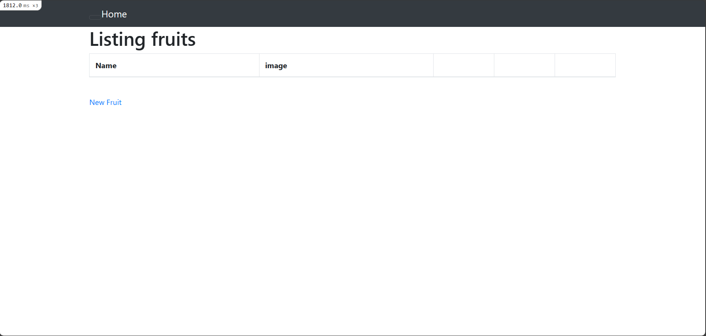
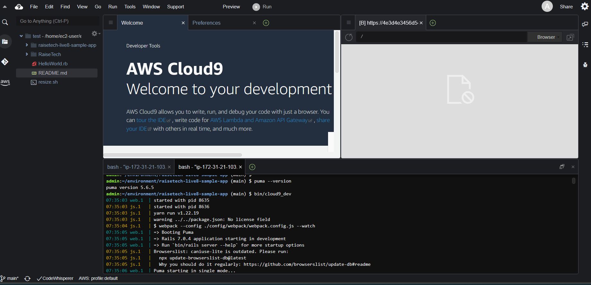
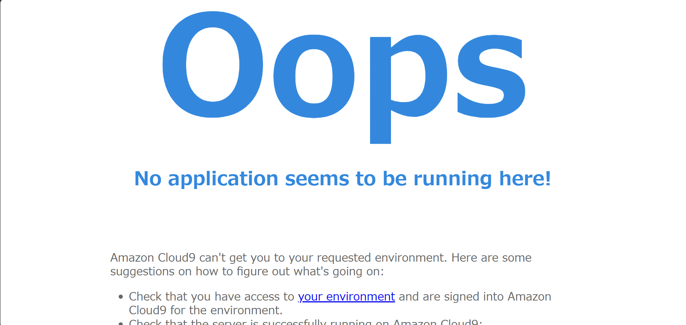
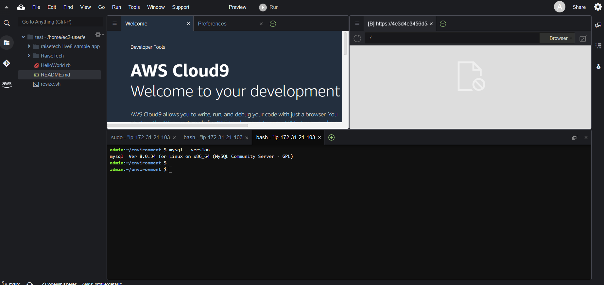
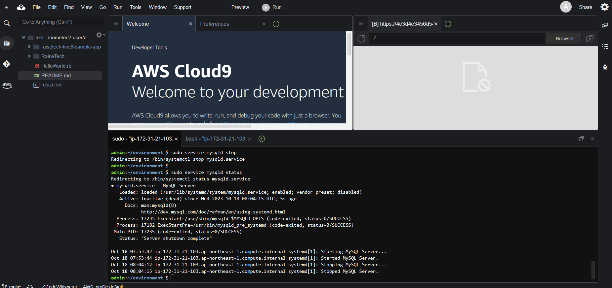
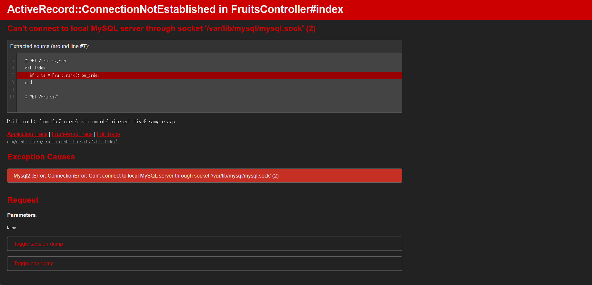

# 第３回課題
## サンプルアプリケーションにブラウザでアクセス

## AP サーバーの名前とバージョンを確認してみましょう。
- puma version 5.6.5

## AP サーバーを終了させた場合、引き続きアクセスできますか？
- アクセスできない

## 結果を確認して、またAP サーバーを起動してください。
- 再度APサーバを起動し、サンプルアプリケーションにアクセスできた。

## サンプルアプリケーションで使った DB サーバー（DB エンジン）の名前と、
## 今 Cloud9 で動作しているバージョンはいくつか確認してみましょう。
- mysql Ver 8.0.34

## DB サーバーを終了させた場合、引き続きアクセスできますか？
- アクセスできない

## Rails の構成管理ツールの名前は何でしたか？確認してみてください
- Bundler

## 今回の課題から学んだこと
- アプリケーションの動作環境の準備としてインストールしたツールについて、
- それぞれの関係性が初めはよくわからなかったが、課題を通して理解が深まった。
