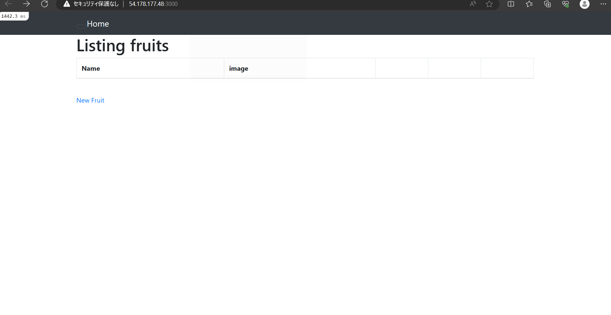
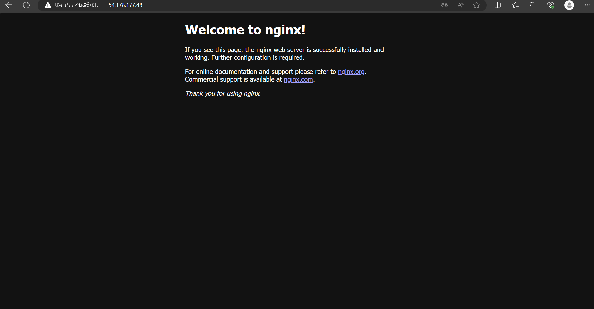
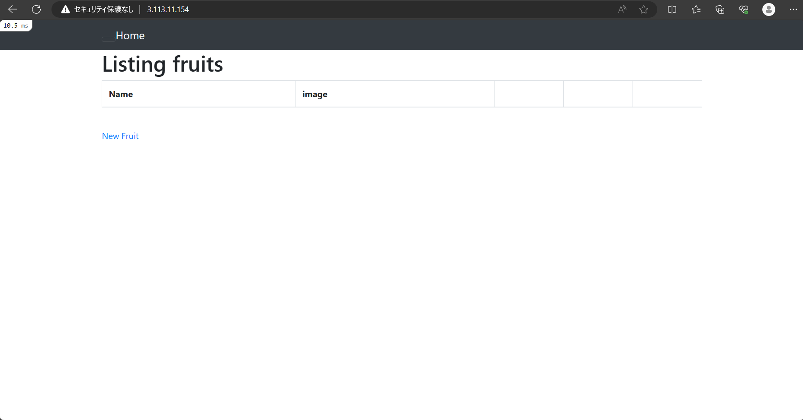
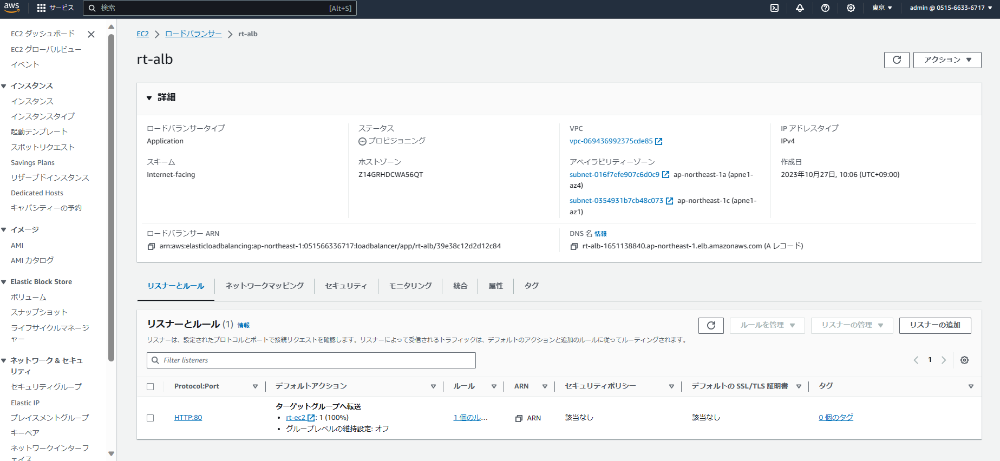
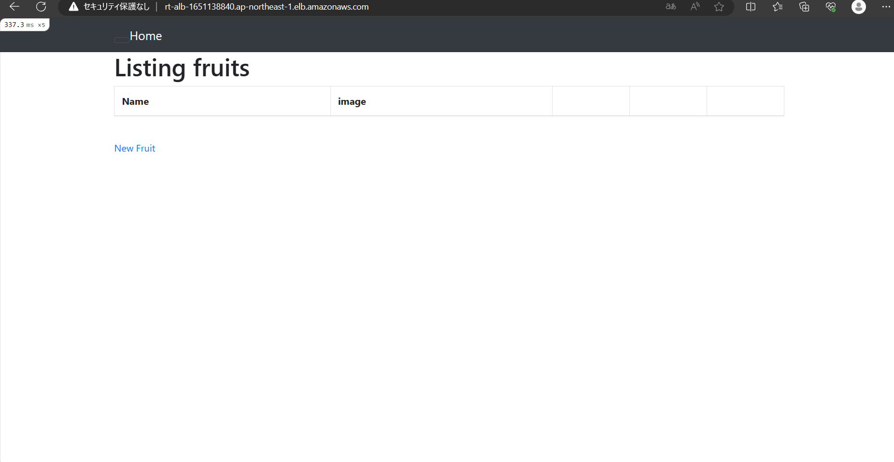
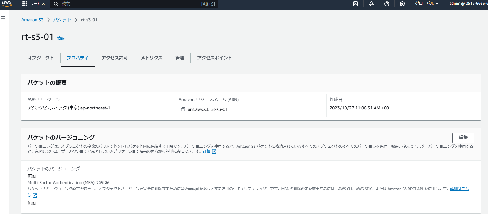
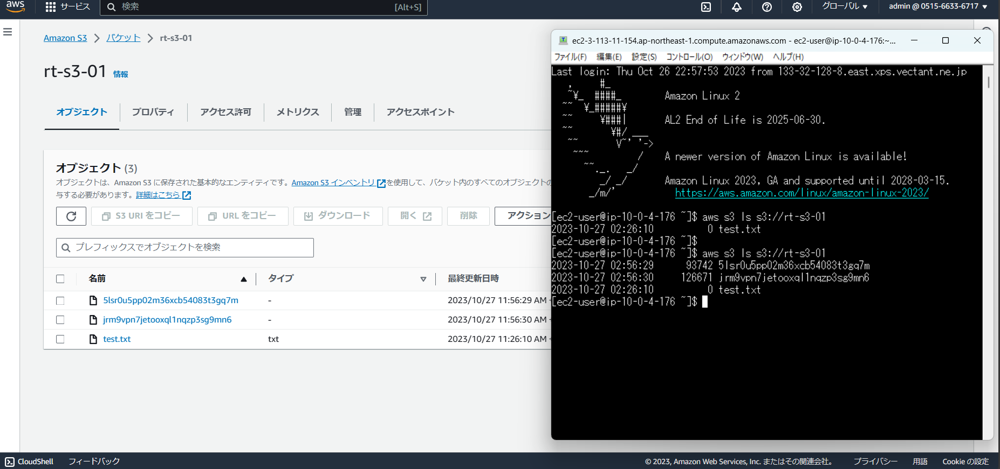
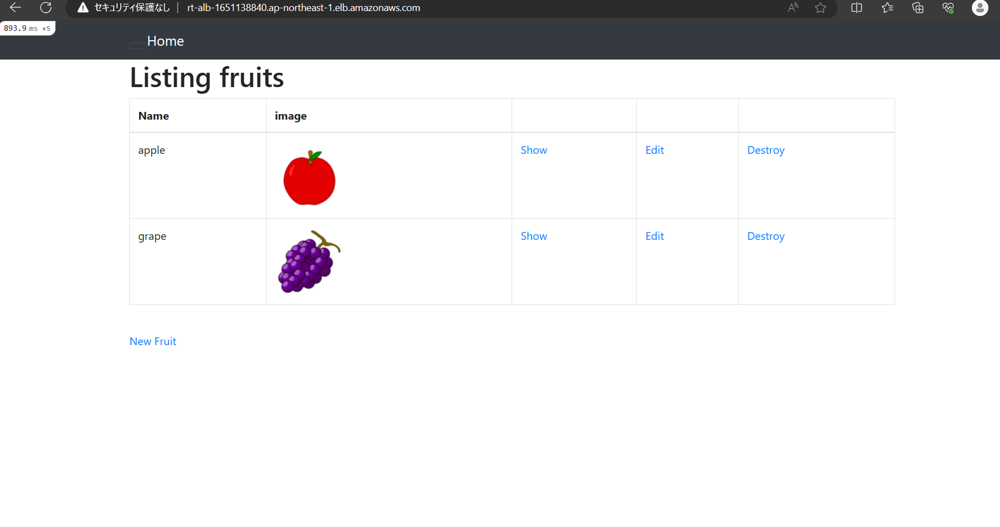

# 第５回課題

## 組み込みサーバーでのアプリケーション実行
- 必要なツールのインストール（git,Node,yarn,ruby,mysql）
- config/database.ymlを編集
- bin/setupでbundelインストール、DB作成

## Nginx＋Unicornでのアプリケーション実行
- NginxとUnicornのインストール
- /etc/nginx/nginx.confを編集
- config/unicorn.rbを編集

## ALB追加してアプリケーション実行
- config/environments/development.rbを編集

## S3を追加

## アプリケーションのデータ保存先をS3に設定
- config/storage.ymlを編集
- config/environments/development.rbを編集

## 構成図

