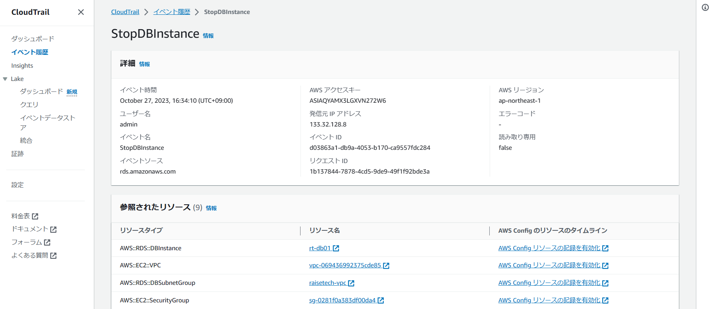
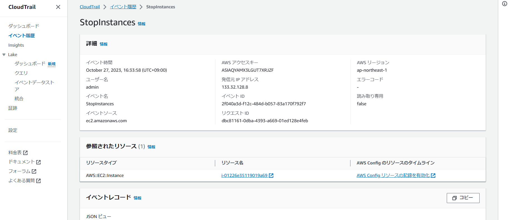
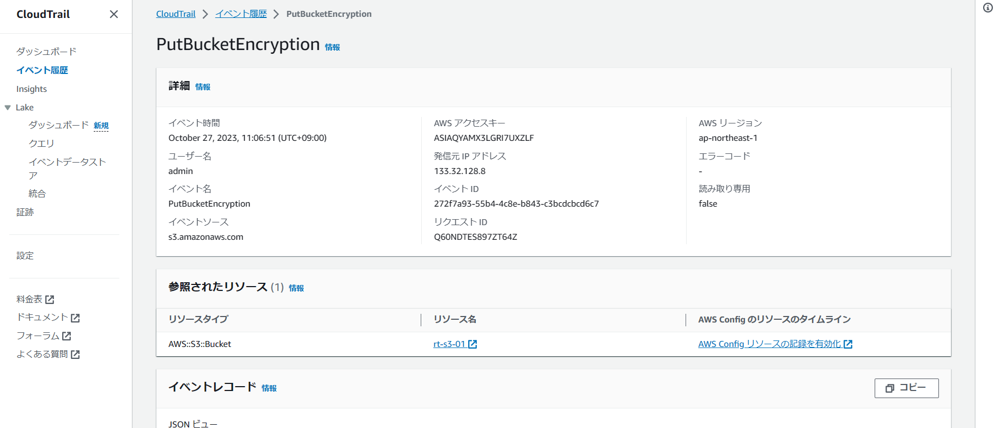
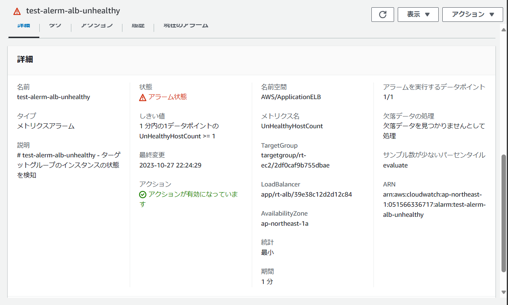
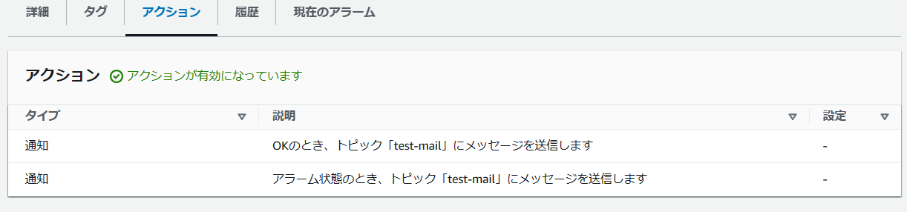
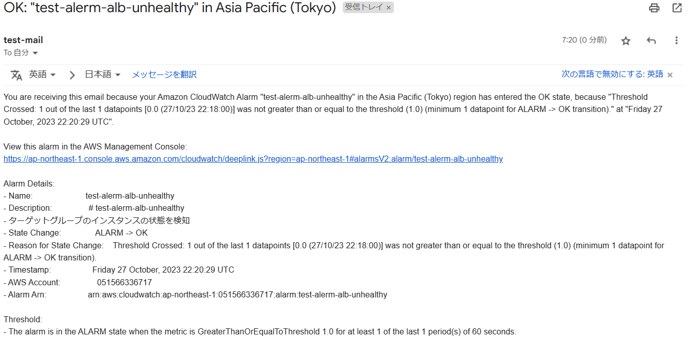
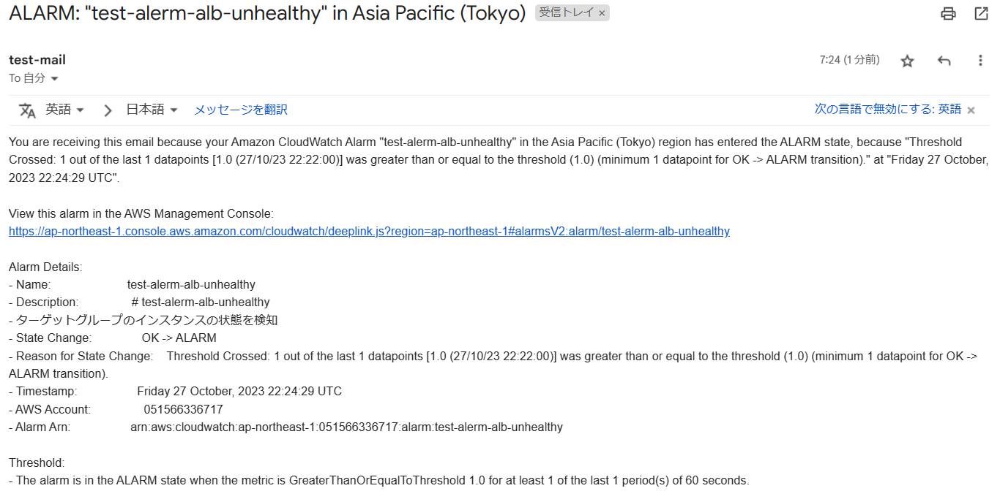
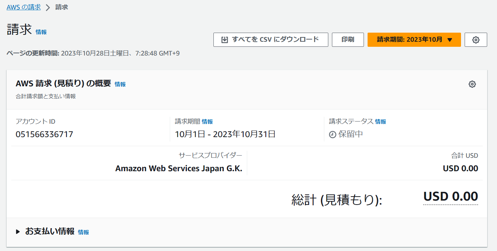

# 第６回課題

## CloudTrail のイベント
- StopDBInstance(RDSの停止)

- StopInstance(EC2の停止)

- PutBacketEncryption(S3バケットの暗号化)

## CloudWatch アラーム
- アラーム設定内容

- インスタンス正常時のメール

- インスタンス異常時のメール

## AWS 利用料の見積り
[見積り](https://calculator.aws/#/estimate?id=175af2545266dd5b168b2c82f4794eaca4186744)

## 現在の利用料

