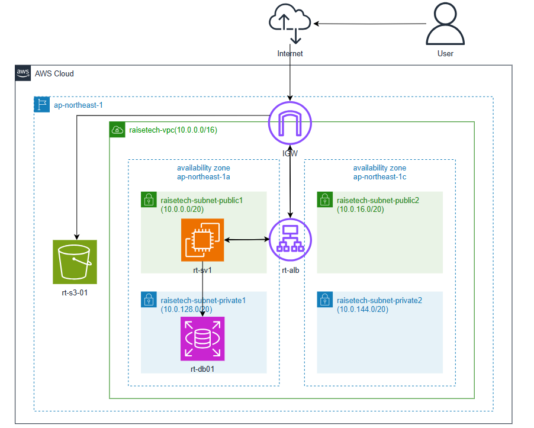

# 第10回課題

## CloudFormationによるインフラ環境のコード化
### 概要
- 第５回で作成した構成を再現する
- テンプレートは以下の３層に分けて作成
  - Network Layer：VPC、サブネット、インターネットゲートウェイの作成
  - Security Layer：セキュリティグループ、IAMロールの作成
  - Application Layer：ALB、EC2、RDS、S3の作成

- 第５回で作成した構成図

### 実行結果
- スタック（Network Layer）

- スタック（Security Layer）

- スタック（Application Layer）

- VPC

- Securitygroup(ALB)

- Securitygroup(EC2)

- Securitygroup(RDS)

- ALB

- EC2

- RDS

- S3

### テンプレート
- Network Layer  
[cfn-Network-Layer.yml](./cloudformation/cfn-Network-Layer.yml)

- Security Layer  
[cfn-Security-Layer.yml](./cloudformation/cfn-Security-Layer.yml)

- Application Layer  
[cfn-Application-Layer.yml](./cloudformation/cfn-Application-Layer.yml)

