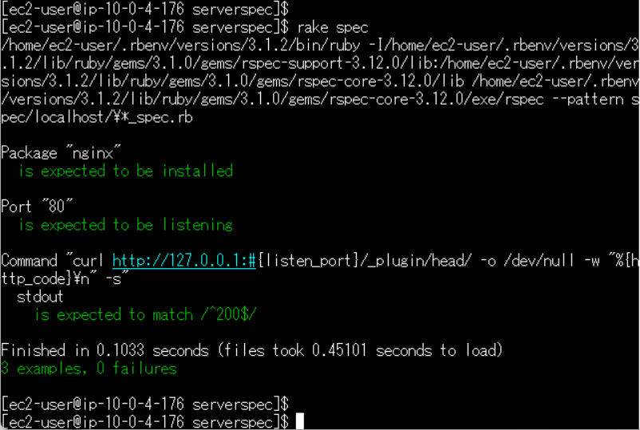

# 第11回課題

## ServerSpecでのテスト
### 概要
- 第５回で作成したEC2インスタンスを使用
- ServerSpecのインストールとセットアップ
- ServerSpecのサンプルコードを編集（listen_portを80番に変更）
- テストを実行

### 実行結果
- nginxがインストールされていることを確認
- 80番ポートが使用可能であることを確認
- テスト接続できることを確認  


### テストコード
sample_spec.rb
```
require 'spec_helper'

listen_port = 80       

describe package('nginx') do
  it { should be_installed }
end

describe port(listen_port) do
  it { should be_listening }
end

describe command('curl http://127.0.0.1:#{listen_port}/_plugin/head/ -o /dev/null -w "%{http_code}\n" -s') do
  its(:stdout) { should match /^200$/ }
end
```
