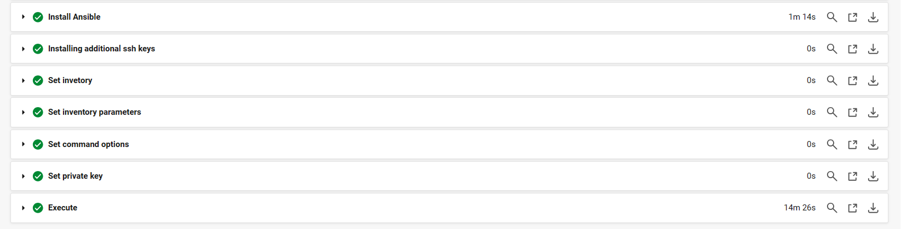

# 第13回課題

## CircleCI で Cloudformation、Ansible、ServerSpecを実行
### 概要
- Cloudformation：第10回で作成したテンプレートでスタックを作成
- Ansible：作成したEC2にサンプルアプリケーションをデプロイ
- ServerSpec：EC2に対してアプリケーション実行環境に関するテストを実施

### 実行結果（CircleCI）
- ワークフロー全体
 

- cfn-lint 
 

- execute-cloudformation
 

- execute-ansible
 
 

- execute-serverspec
 
 

### 実行結果（Cloudformation）
- スタックの作成
 

### 実行結果（サンプルアプリケーション）
- ALBのDNS名でアクセスして画像をアップロード
 

- アップロードした画像がS3に保存されていることを確認
 

### 各種設定内容
- [CircleCI](./CircleCI/config.yml) 

- [Cloudformation ](./cloudformation) 

- [Ansible ](./ansible) 

- [Servespec ](./servespec) 
